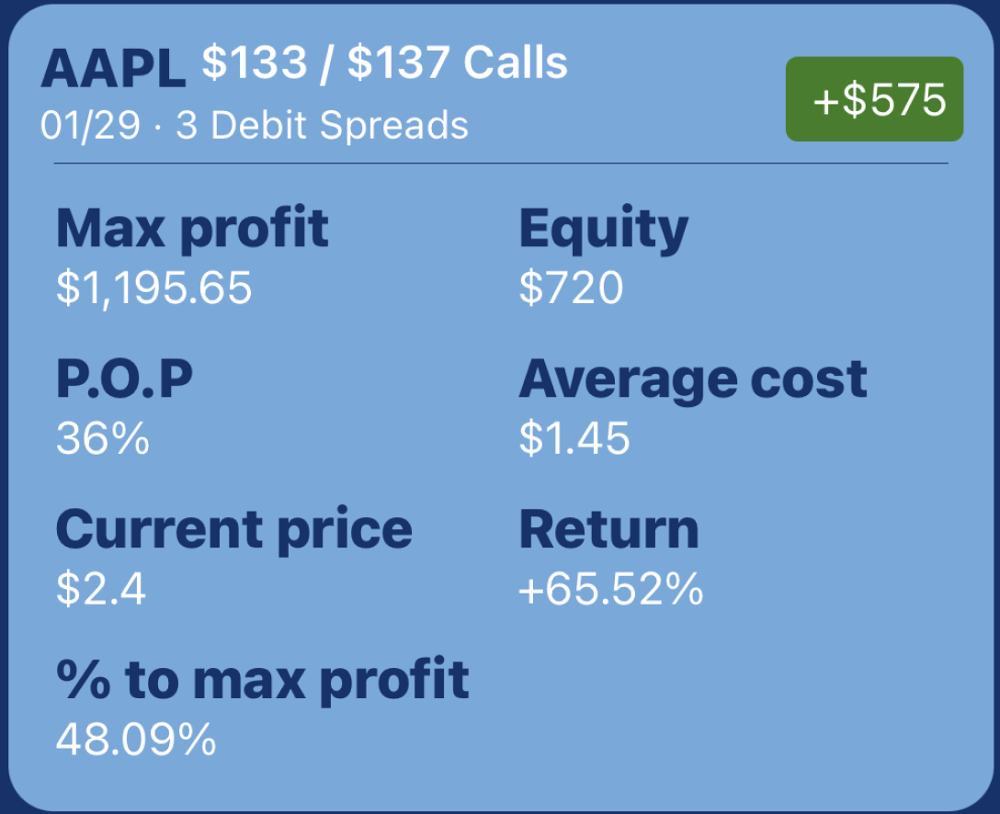

_This article was started before all the stories around Robinhood and $GME GameStop 🚀. I’ll avoid talking about that in this article.  
I will not explain what options trading is in this article, maybe in another one.  
I will not talk about the harmful effect of having a simple app to deal with money._

I’m a Software Engineer currently working at Uber 🚘 in San Francisco 🇺🇸.  
I’ll describe my experience with Robinhood, and why/how I had to build my own app to add the features I thought were missing from Robinhood.

Here is the work in progress app, as of Jan 31st, 2021:


Robinhood, for my European friends, is a ~ trading platform. 💰    
I think it’s a great platform because the UI is simple, pretty, which makes it easy for most of us to start investing/trading.  
It became famous because 1️⃣ `the UI is simple` and 2️⃣ `it’s commission-free`.  
Now, a lot of other free trading platforms exist.  

This article will describe how I use Robinhood, I will list what I think are the missing features and how SoTrade brings solutions.  
I added some technical details describing how I reversed-engineered Robinhood to use their private APIs. 🤘

# How do I use Robinhood?

## Stocks

Whenever I have some cash from a good trade, I buy stocks. Looking at my portfolio, the main company I believe in is Apple 🍎…   
I do not day trade with Stocks, I rarely look at it. I invest and forget about it.

## Options

[Wiki definition](https://en.wikipedia.org/wiki/Option_(finance)): `An option is a contract that allows a buyer the right to buy or sell an underlying asset or financial instrument at a specified strike price prior to or on a specified date.`

I usually day trade with options, or keep up to a week or two.  
I should learn more about leaps. ( = 1 to 3 years out in the future)

## Debit Spreads

I discovered this strategy recently, a great risk-managed strategy. It’s cheaper than options but also your gains are capped. Capped means that you will have a max profit.  
For instance, if you bet that Apple wil be more than $150, it doesn’t matter if Apple is $150 or $200 at expiration, you will get the same max profit.  
As opposed to options where your gains are unlimited.

## Crypto

I don’t really do that, I have a tiny bit of crypto just to see where it goes.   
I do have some [Dogecoin](https://en.wikipedia.org/wiki/Dogecoin) just because there is a doggy on the coin! 🐶

<u>Note:</u>  
You can see that Index funds are missing from this list, it’s because I use `Fidelity` for that. I don’t want to do day trading with it, I want to keep it separate, invest monthly, automatically, not look at it and forget about it.

# What is SoTrade, what functionalities, and how did I build it?

SoTrade is a cross-platform app (iOS, Android) built with [React Native](https://reactnative.dev/).   
I created like a `widget` for every feature that I think Robinhood was missing.  
Users will be able to go to the settings and only add the one they are interested in.

## Notifications

I wish Robinhood had personalized notifications about how my day/week/month went.  
For instance, `This week you made $143, way to go!`.

👉 I built a [CRON system running on Firebase Cloud Functions](https://firebase.google.com/docs/functions/schedule-functions).  
It runs every trading day, at pre-market time, market opening time and closing time.  
It tells me how much I made/lost overnight and how my day went.

Example of notifications:


Once I have access to my Robinhood data, I can really send any useful things: possibilities are endless!

## Debit Spreads

Debit spreads are capped, meaning there is a max profit. The max profit is done when both legs of the options are ITM (In The Money). You get the max profit only at expiration.  
Robinhood doesn’t tell you what is the max profit. It’s actually not complex to compute it yourself. It’s not hard at all, I don’t see why Robinhood would not show it!

I would like more information for Debit Spreads, like the max profit, how far am I from it, etc.

👉 SoTrade is giving you all these information!



## Market hours

In the past few months, I lived in different countries and different timezones, and it always takes me some time to get used to the new market opening time.  
A simple timer to indicate when the market opens would be nice. I think this is a me-problem, so I don’t see why Robinhood would build it lol.

👉 SoTrade has a widget showing a timer for the next important event, like opening, closing, pre-market time, etc.


## Pre-market data

I usually do the same thing before market-opening when I have options: I look at the pre-market of the company, if it’s higher than yesterday, my options should be green. (I made money)  
This is very repetitive, thus should be automated!  
Robinhood shows pre-market for stocks but not for options, AFAIK.

👉 I’m currently building a system to pull the pre-market data of all my options so that I don’t have to do that manually and display it in a nice UI. 🥳

## Portfolio snapshot

👉 It’s actually not a missing feature, but SoTrade does have a summary to tell you how much you have and what’s the daily change, both in $ and %.


## Login screen

👉 I built a login screen describing what it does & showing the Terms of Service.

This creates an anonymous user on Firebase Firestore, using [Firebase Anonymous Auth](https://firebase.google.com/docs/auth/web/anonymous-auth).  
The user in database is useful to store the notification APN tokens, the timezone, and the Robinhood account number. I do not store any personal information like name, age or address.


## Sign-in screen

👉 SoTrade has a Sign-in screen working with Robinhood’s email/password. It can also handle 2FA, it will wait for your passcode to arrive in your phone and ask you to enter it.  

To manage this sign-in on the backend, I’m using the NodeJS Framework named [robinhood-node](https://github.com/aurbano/robinhood-node). (unofficial)

Robinhood doesn’t have a public API, but they of course do have their own private APIs on [api.robinhood.com](https://api.robinhood.com/)!

To get those APIs, the only thing to do is to go to [robinhood.com](https://robinhood.com), right-click, inspect element, go to the Network tab and start analysing the network calls.  
You will see all the GET requests, how the authentication is done, that’s the reverse-enginnering fun part! 🥳


## Authentication to Robinhood with the token

After a successful login, a token will be generated by Robinhood to authenticate future logins.  
This is very important to have a strong security & encryption to store this token, because this is the key to your Robinhood’s account! 🔑  
You can do absolutely anything with this token, so it should not get hacked, under any circumstances!  

Here is how I secure it at the moment 👇

I generated a random string as a secret key, I store it as an ENV variable on my Firebase Cloud Functions backend. This secret key is not stored anywhere, except in the environment variable.  
I’m using [CryptoJS.AES](https://cryptojs.gitbook.io/docs/) to encrypt and decrypt using this secret key.  
Only the encrypted token is stored on the database so that if hackers succeeds to have access to the database, they will never be able to retrieve the original Robinhood token without the secret key.

I encrypt using:

```
const encryptedToken = CryptoJS.AES.encrypt(token, secretKey).toString();
```

For every request, I decrypt the token using the following line:  

```
const decryptedToken = CryptoJS.AES.decrypt(encryptedToken, secretKey).toString(CryptoJS.enc.Utf8);
```

Please let me know if you see a big security flaw here & I’ll work on it!

## Statistics

I love statistics, I’d love to see how well/poor I did compare to S&P500, or compare to other people like `Today, you are in the 9% of worst traders` or `You’re up 9% this week while S&P500 is up 2.3%, yaaay`!

Or just to make it more social: `You’re down 1.8% this week while Robinhood users are on average up 0.2%!` 🥳

# What’s next for SoTrade?

I don’t even know if I’m allowed to do that for someone else than my personal use, because Robinhood doesn’t have public APIs.  
So once I’m done with the implementation of the features, I’ll contact Robinhood and ask them if I’m allowed to publish that app.  
I’d guess that I am allowed because other apps like Wealthfront are also using Robinhood’s data. So why them and not me?  
The security risk of storing Robinhood token is indeed a big risk, I’d need to check that with them.  

If I publish it one day, I’d like people to tell me what features they think are missing so that I can add them to SoTrade.  
I have other ideas for a more long term project, but let’s do baby steps and see where it goes!

# Robinhood, if you read this, I have some more important complaints!

Robinhood is often buggy. Sometimes the cancel button doesn’t work right after placing an order.  
Or I receive notifications a few hours after my order was placed. They suffered from their success and it looks like they haven’t succeeded to work the scale.

Customer support is terrible. They answer a few days after, saying `Sorry we again had an outage, we can’t do anything.`!  
That’s not good Robinhood, please improve your downtime and have a valid customer support.


Seeing this image ☝️ more than once a year is not acceptable!!