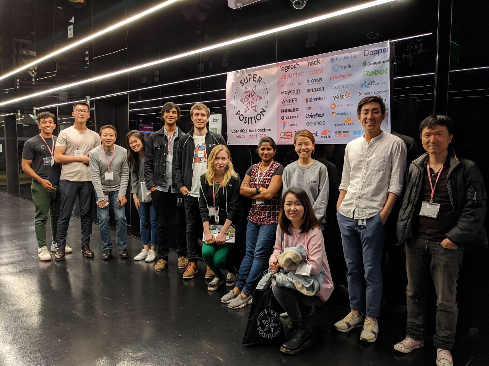
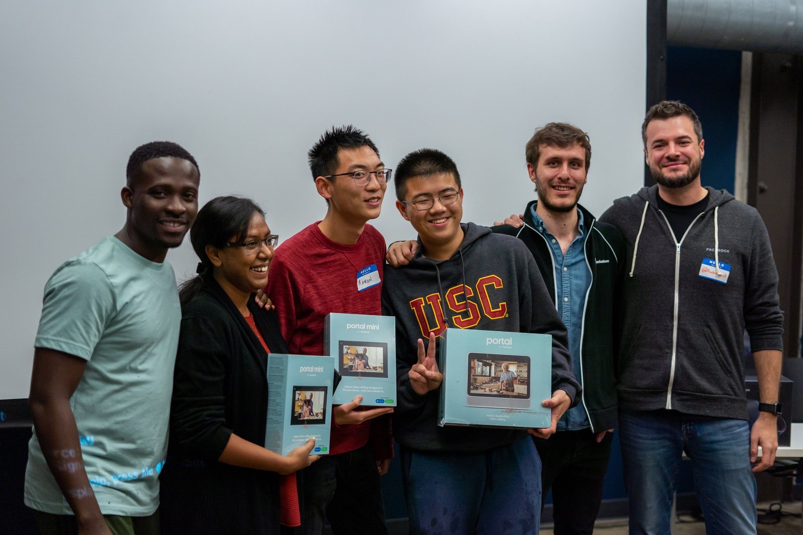

_Highlights of this article:_  

I was a mentor at a Hackathon hosted at Uber HQ in February 2020.  
Out of nowhere, I ended up teaching & doing workshop about introduction to iOS development to a group of students.  
The group seemed to love it, especially one person who was asking the right questions, all the time.  
Most of the people wanted to learn how to make an iOS app in order to deliver for the Hackathon (which is great & totally fine!), but a person in particular wanted to understand, really understand things.  
Most of them almost never programmed before.  
I absolutely loved explaining `complex things in a simple way`, and see the happiness in their faces when they clicked on RUN and they had their first iOS app ever! 😍

At the end of the Hackathon I received the following message from the person who, I felt, really wanted to learn iOS development:  

_“Hi again Arthur! I just wanted to update you that we were able to finish a prototype of our app EcoBud. We also won Director's Choice Award: Best Environmental Hack. Thank you for helping us get started and teaching us the basics. I’m inspired by you to continue learning iOS app dev :) have a great weekend!”_

I almost wanted to cry 😭, from `0` to `learning so much and receiving an award` in 24 hours, that's insane!

So I asked her if she wanted me to mentor her outside of the Hackathon, by providing learning resources etc, and maybe check on her ~ once a month: she accepted.

It's been approximately 3 months since the Hackathon, you wanna know what she did during that time? _I can already tell you this person is super impressive!_
- She is now participating to other online Hackathons (COVID...) and won some!
- She is doing iOS development 3 to 4 hours a day & she loves it! She is learning different architectures, ARKit, CreateML 🤯
- And the big news, `she is starting her Computer Science degree at Stanford University in a few months`... WOW!!

This makes me even more want to cry, in ~ 3 months she went from `0` to `creating apps and being accepted at Stanford University` to pursue a career in Computer Science!

I have the feeling that I had a positive impact in her life by helping a tiny bit and that is an amazing feeling! 😃  
I'm super impressed by her, she just did not stop, found a passion, kept going, tried, and honestly she did not ask for help either.  
I just provided the initial help/resources and she did everything by herself! 👏

--------------------

This article is about describing what a Hackathon is, what is a role of a mentor, and my personal experiences.

# Definitions

If you already know what a hackathon and a mentor are, you can directly click [here](/hackathons-mentor/#my-hackathons-experiences).

## What is a Hackathon?

It’s an event, usually lasting between 1 to 2 days (24 to 48 hours, but can be longer) where people meet and create a product from scratch. There is usually a theme like for instance it can be Smart Cities or Education.  
In the word "Hackathon" there is the word "Hack", which indicates that it's about hacking together, and not delivering a perfect production-ready solution. It's expected that the product barely works.

## What is a mentor?

A mentor is a person who can help/guide another person.

### Mentor in hackathon

A mentor in a Hackathon is someone who usually had done a few Hackathons as a participant in the past. The mentor is usually more experienced than the average experience of the participant group.
The job of the mentor varies depending of the stage of the hackathon.

- Beginning of hackathon:  
He or she will brainstorm with the participants if they want to, to make sure that the idea/product is not too crazy so that it can be done in the hackathon time. For example “creating a new computer operating system” might be a stretch if you’re a beginner and you have 24 hours. 😇

- During the hackathon:  
The mentor will go from group to group and help/unblock if they need. For instance if a group is stuck on a technical subject, the mentor will read the code and try to unblock, or call another mentor.
The mentor can also teach, for instance if a group wants to do an iOS app but nobody from the participants knows about iOS development, the mentor can organize a workshop and teach the basics.

- End of hackathon:  
Participants usually need to prepare a quick presentation to explain what the project was about, the solution, the challenges etc.
The mentor can help, provide some advice for the presentation.

### Mentor in a company

We can dissociate two types of mentors: “mentor” and “buddy”.

A buddy is someone who help a new hire to be onboarded, explain how to company works, how to find help, who to talk to, the office, if he or she is new to the city maybe explaining how to open a bank account etc, basically answer all the questions the new hire can have.  
The job of a buddy is to make sure the new hire integration is as perfect as possible.  
The duty of a buddy slowly fades out over time, as the new hire integrates more and more into the company.

A mentor is someone who will be here to help and guide on a longer term. The mentor is usually more experienced than the mentee, so they meet at least once a week or every two weeks to talk about how the work is doing, careers progressions etc. It can also be more personal discussions if they are comfortable, up to them!

### Mentor in real life
I guess you start to understand what a mentor is about.  
A lot of people in Silicon Valley have mentors, even CEOs!  
Anyone can have a mentor, for instance to talk about career progressions, personal development etc.

# My Hackathons experiences

## As a participant

I personally participated to a few hackathons, at different stages of my career. (student or engineer)

At the beginning, I was super excited because I was either learning a new technology, or using a cool techno with some time constraints.
That's pretty fun, meeting people for the first time, brainstorming, coding day and **night**, usually eating pizza; the dream!

But after doing a few hackathons + constantly doing side projects, using the same techno, I felt I was having less fun.  
Of course it's up to me, I could use different techno, doing maybe some AI or ML stuff instead of the usual website/mobile application, but that's what the team usually lands on.

You can learn more about my favorite hackathon as a participant, [the Facebook F8 hackathon](https://lifegorithms.com/f8-2019/)!

The hackathon hosted at UC Berkley, named [Cal Hacks](https://calhacks.io/), was also pretty impressive in a sense that more than 2500 people were hacking day and night inside the Berkley stadium. It was my first time in the Berkley University campus so the WOW effect was definitely there!    
Now that I think about it, (during the COVID quarantine) I have a hard time imagining something similar happening again, we were 2500 people in the same location, next to each other! 🦠

## As a mentor

I participated to two hackathons as a mentor so far.

The first one was a Facebook hackathon in San Francisco.  
I LOVED doing it, people told me that just by looking at me they could see I was having a fun moment!

The second one was one hosted at Uber HQ, please read the _highlights_ at the beginning of this article.

# My mentoring experiences

## In the company

In my current job @Uber, I had the opportunity the become a buddy and a mentor, I love it!

- I am mentoring a Junior engineer. Uber is his first full-time job.  
We're on the same team so we can talk daily, but we have a 1-1 meeting once a week. (twice a week for the first two months)  
I have the feeling that I am helping, but also that I can be even more helpful by having something more structured in mind. I'll do more research about it.

- I am mentoring a designer to code.  
He is a super talented designer, and also now (almost?) a software engineer! He is super excited about learning more, coding, GIT, how it works at Uber etc.  
I have to admit; he impressed me, he was able to land his first code in production super quickly, he is now able to write his code without me, mainly UI fixes (padding, colors etc), create Feature Flags, and land his code in production!
He unfortunately left Uber yesterday (when I'm writing those lines) to go to Apple, super happy for him and I wish him all the best there!  
He told me a few times that he was waaaaaay more excited about coding and fixing bugs than doing his daily design work 🙈  
I _will_ miss you!

## In real life

I am only checking / answering questions to one person at the moment, see _highlights_ at the beginning of this article.  
This can be something I can focus more in the future.

## In Developer Circles San Francisco

I won't spend too much time in this article describing what [Developer Circles](https://developers.facebook.com/developercircles/) is, but part of being the lead for San Francisco I decided to create a Mentorship program to help CS students.  
It's a Work In Progress program, stay tuned!

## In Hackathons

See [here](/hackathons-mentor/#as-a-mentor).

# Conclusion

By mentoring, I have the feeling that I can have an impact on people's lives.  
I know that when I create a feature for my company, I also have an impact, but it's not the same kind of impact.

I absolutely love sharing and explaining things to people.

I am wondering if, part of my daily job, I can make this mentorship idea more important?  
It can be either about mentoring, or creating a program to teach designers/PMs how to code inside the company, or ...? 🤷‍♂️