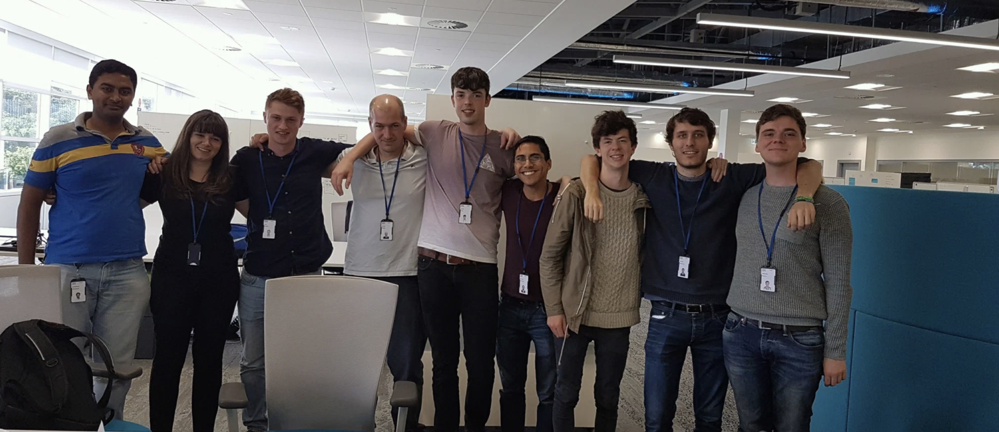
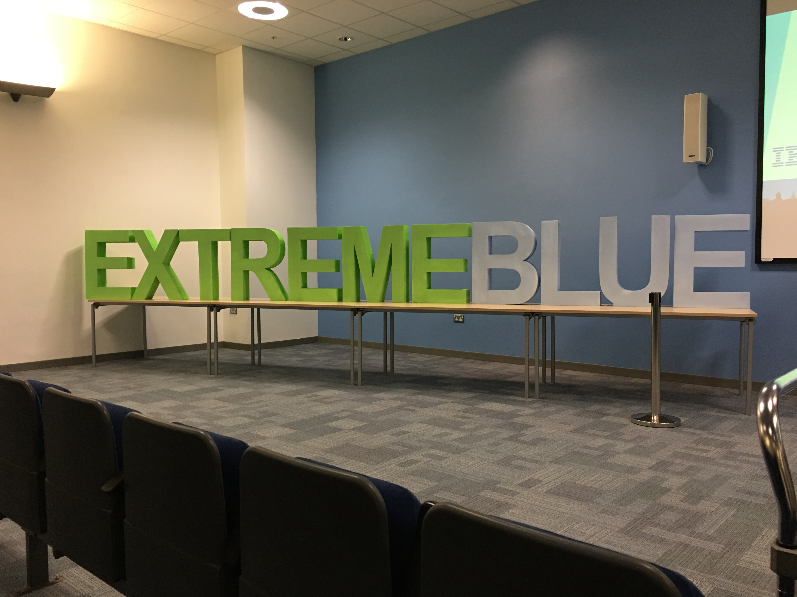
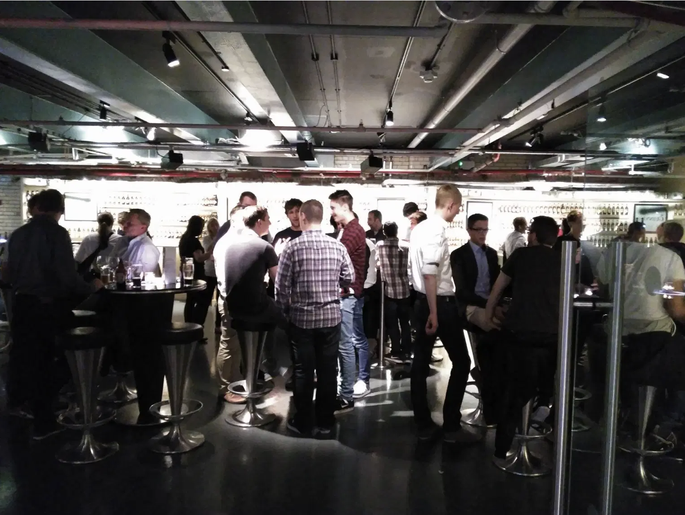
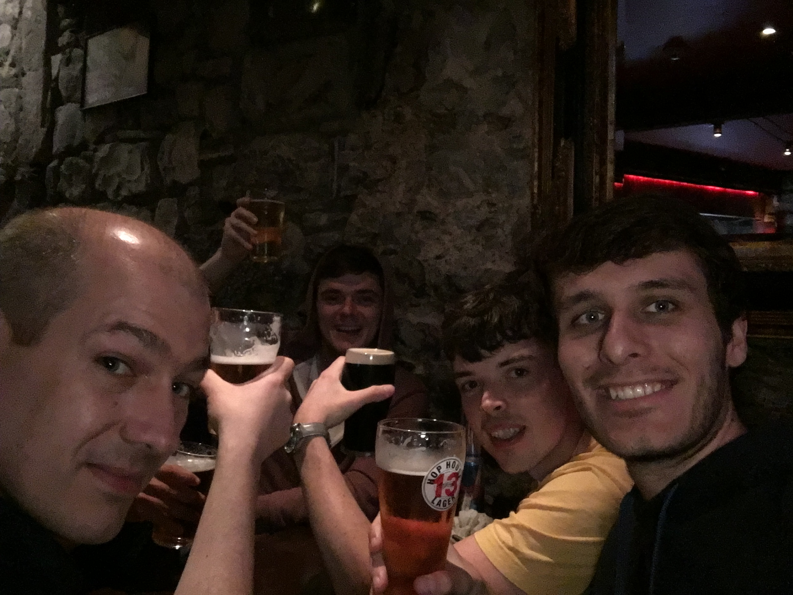

This post summarizes my 2016 internship experience at IBM Dublin, **from June to September 2016**.  

TLDR; That was awesome! 👏

## What is Extreme Blue?

[**Extreme Blue**](https://www.ibm.com/employment/extremeblue/) is the internship program proposed by IBM.  
As they currently write in their website, _There are internships, and then there’s Extreme Blue™_.  
I agree, I did a few internships and Extreme Blue was ... different. I think it's a good summary to say that Extreme Blue is an internship program, but it's not the same as being "an intern" at IBM.

An intern in a company, from my previous experiences, is like being a full-time employee except that you don't have the same expectation in terms of work, you're here to learn first, and the time is generally limited, 3 to 6 months.

With Extreme Blue you don't necessarily work on an IBM product/project, it's more a project specially thought for this program. You're only with other interns, as opposed to my other internships where I was part of a team with other full-time employees.

## Why IBM and not somewhere else?

My goal/dream was always to work in Tech in Silicon Valley.  
I knew that as a French, it is possible but the solutions are limited.  
For this internship period, I applied at a lot of places but didn't even pass the resume step at other big tech companies. I knew that a big name like IBM would help me in the future to at least have an interview.

I ended up interviewing with two companies, IBM and [Earny](https://www.earny.co/home) and received offers from both of them.  
My role at Earny was about being one of the first engineers of the startup, and TLDR of what Earny is doing is _"Earny’s app gets your money back on purchases after prices drop"_.  
Earny is based in Los Angeles and was in a Startup Incubator in Santa Monica.

I had a hard time to decide, both companies seemed to have equally interesting projects! On one hand, Earny was located in Los Angeles, which would bring me closer to my Silicon Valley life, on the other hand IBM was a big name and would possibly either bring me to the US or at least add a valuable name on my resume.

As you can guess, I hope, I ended up choosing IBM. 🥳

## Selection process

The process for Early was a few phone calls with the founders, some technical calls but nothing too complex, more high level than code.  

The process for IBM was more similar to what we can expect from a tech company, some online coding interviews etc.  
Overall, it was _waaaaay_ easier than any of my following Google/Uber/etc interviews because it was less coding and more of everything.  
For instance, I had a managerial interview, a coding design challenge to do at home where I had to design/architecture a video game, some coding exercises and finally a skype live coding interview.  
But still, easier than Google.  

## Where was it?

Extreme Blue has a program in a few city in Europe/US, but I think I only applied for the Dublin program. I don't know why only Dublin, maybe at the time I didn't realize they had other cities.  
I was excited because Dublin is Dublin 🇮🇪, the city of 🍻and live music 🎶! (At the time I was still drinking beers)  
But most importantly excited because I would improve my english! I was so bad in english, really bad, and I knew it was a requirement for my career in Software Engineering.

## What did I do during this internship?

We were a total of 9 interns, split into two groups.  
The project Toscana and the project Security, both super interesting!

I was in the project Toscana with 4 other peers.  
Toscana was the internal name of the enterprise chat solution IBM was building.  
The tech stack was mainly around JavaScript, React for the front, Node for the back.
I knew these technologies from previous side project, so it was nothing entirely new but I still learned a lot because it's clearly not the same coding for a small side project and coding in a large codebase in a big company!

Toscana was super interesting, it was about reducing the noise in a group chat.

To solve that, we were analyzing the content of the conversation and proposing smart **reaction** (for instance short sentences _"Thanks!"_ or emojis 👍/👎) based on the context of the chat.  
To do so, we were using a set of tools provided by IBM Watson like sentiment analysis, tone analysis etc.  
It worked well, I was surprised! 😂

_Updates 2020_:  
Around two years after the internship, Toscana was discontinued and around 4 years after, IBM switched to Slack for all employees which had an important consequence on Slack stocks. When IBM announced they were switching to Slack, [Slack had a +21% jump on their stocks](https://markets.businessinsider.com/news/stocks/slack-stock-price-ibm-biggest-account-global-employees-messaging-platform-2020-2-1028890304)!

## The final presentation!

The last week of the internship, all teams from across Europe came to Dublin to give a presentation about their projects. I don't remember exactly how many people were at the presentation, let's say 15 teams composed by 5 people + a mentor per team + some IBM employees from Dublin = 15 * (5+1) + 100 ~= 200 people.  

We trained every single week for this presentation by doing mock presentations in the hall of the IBM cafeteria.  

It was stressful to talk in front of a lot of people, but overall it went really well!

At the end of the day, IBM rented the Guinness Storehouse at St. James’s Gate, we had a lot of fun, we learned a lot and we drank a lot! 😎

## How is living in Dublin?

I had a really good time in Dublin, but I don't think I'd live there again. Of course, never say never, that's why I say _I don't think I'd live there again_. 😇

The main reason is the weather, really bad weather. 🌧
But I highly advise to visit Dublin or the country, great views, great bars, great (live) music, lots of great things!

I discovered my favorite beer of the time, [Hop House 13 Lager](https://www.guinness.com/en/our-beers/guinness-hop-house-13/), I was living near the city center, I met really smart, fun & nice people and I visited a few times all the bars of Dublin! 😳

Around the end of the internship we (almost) all went in a trip to Galway for a long weekend, it was **grreeeaaaaaat**! You can guess our main activity there. 🙄

## Why didn't I join full-time there?

They proposed me to directly join full-time as soon as I'd graduate, but I refused. At first I refused by saying a joke like _"Ho no sorry, it's too rainy for me"_ but they didn't really understand the joke so they proposed me to increase my package. 💰 (that was a funny moment for me, because when I try to negotiate for real it just doesn't work)  
The reason of my rejection was because I wanted to join the US, I was stubborn, and the offer was for Dublin.  
I did ask them if I could join IBM Austin but they were not super excited about the idea.

_Updates end-2019:_ But it's okay, I made it to the US 🇺🇸!

### More resources

Every week we had to write in turn an article in the [IBM Extreme Blue blog](https://ibmextremeblueireland.wordpress.com/), it's great I highly encourage to check it out! 🙃

