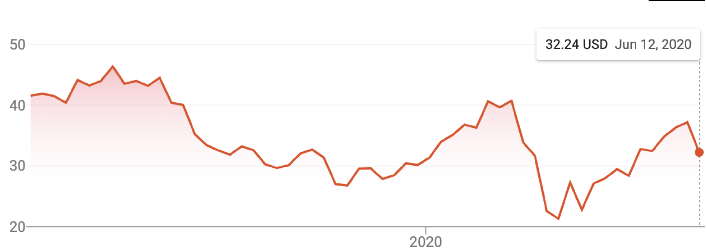

___Disclaimer:  
This article is about sharing knowledge. You should also do your own research and not simply do what is written here. I will not be responsible for what you do with your money. I am not a financial advisor.  
I will generalize a lot of things and use simple terms on purpose.  
Please [let me know](https://twitter.com/papay0) if I wrote something wrong so that I can learn and correct this article.  
This is NOT a step by step tutorial about how to invest your money.  
I only describe things related to the stock market, other ways to invest exist and I will not describe them here.___

-------------------------

There are a few things you should know about your money.  
This article is about what I learned in my first 10 months living in the US, and what I wish someone would have told me on my first day.  
I will explain why you should NOT let all your money on your savings account, if you have the luxury to spend less than what you earn.

**TLDR;**
- Because of the inflation rate, letting your money in your bank is like losing some money every year.
- You should invest only if you’re willing to lose.
- You should max out your 401k if you can.

# Inflation
> Definition: `Inflation is a general increase in prices and fall in the purchasing value of money.`

[Here is the inflation rate in the US in the past few years:](https://www.usinflationcalculator.com/inflation/current-inflation-rates/)
- 2016: 2.1%
- 2017: 2.1%
- 2018: 1.9%
- 2019: 2.3%

This means that if your money grows less than this inflation rate, it’s like you’re losing money.  
Here is an image to better understand how the value of money changes over time.

When your money is in your bank account, it doesn’t grow. For instance, [Chase](https://accounts.chase.com/raf/share/2597181386) has an interest rate of 0.01%.

Now that we know what inflation means, we understand that we should aim for a solution that grows your money more than the inflation rate.

# Investments

All the money you invest is money you are willing to lose. There are risks in any investments. Some riskier than others.

## Stock Market

You have multiple ways to trade on the stock market, I will only describe three ways, each with different risks.  
Two manual ways (if you’re feeling like adventurous) and one automated way. (if you don’t want to think about it)

### Individual stocks

Individual stock trading might be risky. I do not advise beginners to start with this solution. This is usually a manual solution. You can use applications like [Robinhood](https://join.robinhood.com/arthurp367) to trade. There are no commission fees, which means it’s free for you to trade.  
*You can read more [here](https://www.investopedia.com/articles/active-trading/020515/how-robinhood-makes-money.asp) about how Robinhood makes money.*

You can buy/sell individual stocks like Apple, Tesla, Google etc or any other company publicly available on the stock market.  
You can also trade using [options](https://www.ally.com/do-it-right/investing/trading-options-for-beginners/) but I will not describe what this means in this article.  

Individual stocks are riskier because your money is very tight to the company and its result, it can go up or down from one day to another, by a high %.  

As you can see in this Uber stocks example the market price is very volatile, way more than for an ETF. You can be positive 📈 (you earn a lot) … or you can lose it all in no time.  

### ETF

> Definition: `Exchange-Traded Fund (ETF), is an asset that tracks a particular set of equities, similar to an index.`

This means that instead of tracking an individual stock like Tesla, it tracks an overall category of stocks. A category can be `Energy` or `Technology` or `Health` etc.

Let’s take the example of the [S&P500](https://www.google.com/search?q=s%26p+500), an index following the 500 largest US companies.  
To simplify we can say that the price of this index is an average of the price of the 500 largest US companies.  
*You can read [here](https://www.investopedia.com/ask/answers/05/sp500calculation.asp#:~:text=The%20individual%20market%20weights%20are,cap%20was%20approximately%20%2423%20trillion) to know the exact calculation.*

What it really means is that if `only` the price of Apple is going down (for some reason), it will ~ not affect the price of the S&P500 because the price is averaging 499 other companies.  
S&P500 is a preferred solution over individual stock trading because it is following the entire market of technology and not a singular company.

As you can see in this graph, overall it went up by an average of 10% year over year.  
10% is way more than the inflation rate we discussed previously.
Of course, crises happened, happens now and will happen in the future, but it also recovered, recovers, and will recover.

Let’s take an example to describe what 10% year on year means for your money:  
Let’s say you invest $500/month during 30 years at 10%, this would become `$1,039,645.82`  
Now, if you saved the same amount in your savings account, after 30 years it would be `$180,000.00`.  
There is a difference of `$859,645.82`!

The money you put on an ETF is not money you will instantly need. You should put money there when you can and not look at it until you retire.  
Once you retire you might have a good surprise. 🙃

### Robo advisor

> [Definition](https://www.investopedia.com/terms/r/roboadvisor-roboadviser.asp): `Robo-advisors are digital platforms that provide automated, algorithm-driven financial planning services with little to no human supervision.`

As the definition is saying, a robot is investing for you so you don’t have to worry about anything.  
You can choose the level of risk you want to take.  
I’d say it’s a good solution if you don’t want to think too much about your money.

Robo advisors are usually taking a management fee, for instance, [0.25%](https://support.wealthfront.com/hc/en-us/articles/211003683-How-much-does-Wealthfront-charge-for-its-service-) for [Wealthfront](https://www.wealthfront.com/c/affiliates/invited/AFFD-VX1X-JOTT-DEHZ).  
When I arrived in the US and I didn’t know much about stocks, I was using [Wealthfront](https://www.wealthfront.com/c/affiliates/invited/AFFD-VX1X-JOTT-DEHZ), I haven’t tried other ones. I was pretty happy with this one so I can only advise it.

You can set an automatic transfer from your bank account so you really have nothing to think about.

## Paying taxes

Do not forget that you pay tax on your gains, please read more [here](https://www.ameriprise.com/research-market-insights/tax-center/tax-planning/how-are-investments-taxed/).  
This means, not all your profit goes into your pocket!

# 401k

If you have one thing to remember from this article 👉 `MAX OUT YOUR 401k IF YOU CAN` 👈.

> Definition: `401k is a tax-advantaged retirement plan offered by many US employers to their employees.`  

When you fund your 401k, it is from `pre-tax` money, meaning your contributions are taken from your paycheck before taxes are deducted.  
For example, if you put $100 into your 401k each month, your paychecks might only get smaller by about $60-$80 per month. The exact amount will vary depending on your salary and tax bracket.

Because it is funded with pre-tax money, it means that you lower the amount of income you have to pay taxes on, and this is good news!  🥳

Employers sometimes offer `Matching`, if that’s the case, it’s like free money so you really should take advantage of it!  
Let’s take an [example](https://www.thebalance.com/what-is-a-401-k-match-2894179) and use a worker with a salary of `$50,000` as an example. If she contributes 6% of her salary into the company 401k, she will have `$3,000` in the plan after the first year. If her employer does a 100% match, she will have `$6,000` in the plan. If her employer does a 50% match (or 3% of the employee's salary), she will have `$4,500` in the plan.

You don’t pay tax when you put money in but you do when you take money out.
You should not take it out before you’re 59 ½, it’s for your retirement.  
If you do need it, you can take it out but you pay a 10% early withdrawal penalty on top of any taxes due.

You have a maximum amount you can put in every year, around $20k.

# (Backdoor) Roth IRA

> Definition: `an individual retirement account allowing a person to set aside after-tax income up to a specified amount each year. Both earnings on the account and withdrawals after age 59½ are tax-free.`

This is kinda the opposite of the 401k, meaning you fund your account with money you already paid tax on, but then it grows and you will `NEVER` pay tax on!

You cannot contribute directly to your Roth IRA if you have a high income.  
You can contribute a maximum of `$6000` per year.  
The limit income for a single in 2020 is `$124,000`.

But there is a `legal loophole` if you earn more than this limit and you still want to contribute!  
This is called a `Backdoor Roth IRA`.  
You can read more [here](https://www.moneyunder30.com/how-to-open-a-backdoor-roth-ira) but to summarize how a backdoor Roth IRA works, you can fund a traditional IRA and then transfer your money from the traditional IRA to the Roth IRA.  
It sounds complex but it’s very simple and can be done in a few minutes.  
This [YouTube video](https://www.youtube.com/watch?v=iD-M5Bxjv00) explains the step by step process.

# HSA

> Definition: `Health Savings Account (HSA) - a type of savings account that lets you set aside money on a pre-tax basis to pay for qualified medical expenses.`

Again, this is pre-tax money. I feel like if you can afford to, you should do everything pre-tax money related as it will lower your income tax bracket.

What it really means is that you put this pre-tax money on an account that you can use for medical expenses.

You can even invest this money, right from their website.  
When I first learned that people could buy TESLA shares with their medical money, I was 🤯!

Employers can also contribute, if they do, you should really think about doing it!

# Conclusion

If you read these lines, you’re most probably a beginner like me.  
If you want to invest, I’d advise you to either use a Robo advisor like [Wealthfront](https://www.wealthfront.com/c/affiliates/invited/AFFD-VX1X-JOTT-DEHZ) or manually invest in index funds, like S&P500.  
If you feel adventurous you can try trading manually on the stock market.  
You also should, `if you can`, max out all your investment pre-tax like 401k, especially if your employer offers a Matching!

