This article contains two parts, the first one [describing the key moments of 2020](http://localhost:8000/review-2020/#key-moments) (it also serves as memories), months after months, and the second one being a [reflection of the year](http://localhost:8000/review-2020/#reflection).

2020 was my first full year 'living' San Francisco, as I moved there in September 2019.

# Key moments

## January

I was in France for the first two weeks, visiting Paris and Bandol.

I was in San Francisco for the last two weeks, in my studio in Dolores.

I went skiing in Tahoe, it was my first time there. This place is beautiful!

## February

Moved with a roommate in Mission Bay, worst decision of the year, it was a disaster. She was behaving like a monster.

Rented a motorcycle with my friend Marta and drove to Napa.

I went to Angel Island with friends. Might have been the last social interaction without freaking out about Covid, February 22nd.

## March/April/May/June

- Pretty bad months, living hell with my roommate.
- Started to work remotely.
- Uber (my current company) was doing lots of layoff, I was extremely stressed because of my VISA situation. If I was laid off I’d need to leave the country.
- I was going on daily walks around Mission Bay, I was taking my (non-computer-required) meetings from a bench facing the water.

I was introduced to a Messenger Zoom Workout group, this saved my year. People leading the workouts were amazing, great human being, it gave me a sensation of belonging to a community, much needed during Covid.

Did my birthday with Family & Friends over zoom.

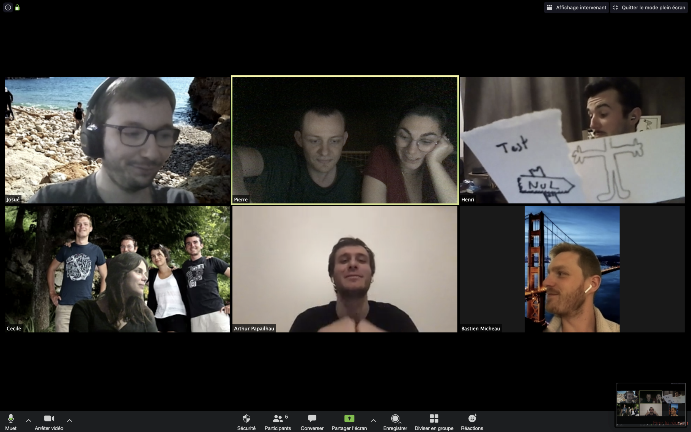

## July

I couldn’t handle the roommate situation anymore, I found someone else to take over my lease, did a few weeks of Airbnb in San Francisco.

I rented a bike for 4th of July and went from Mission Bay to Sausalito, and back: ~ 38km.

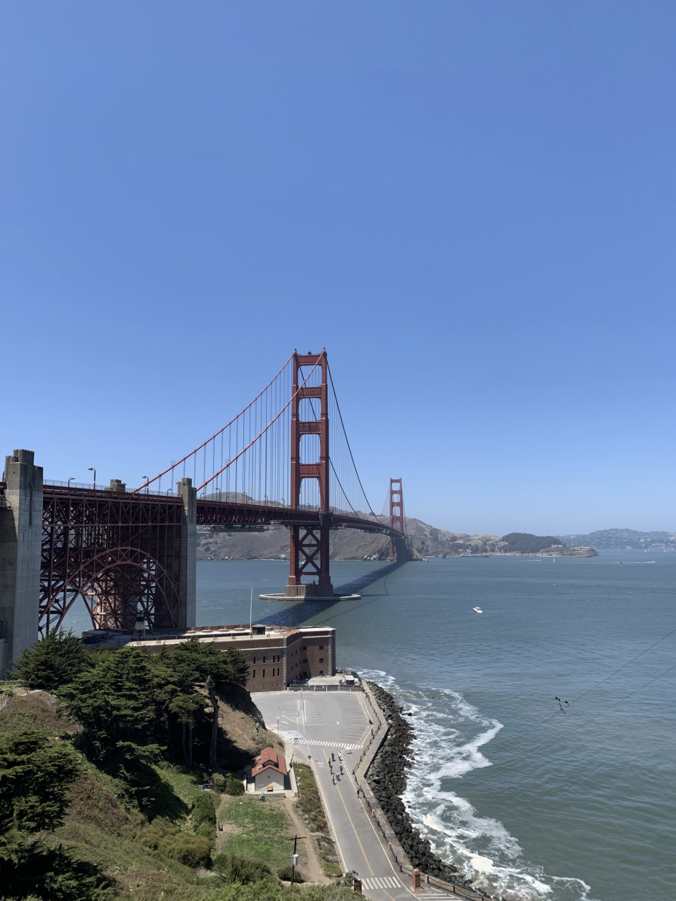

## August

Flew to France, reunited with the family.

Lilou, one of my two cats, died a few days after I landed. Very sad moment. 😭

Picture of Lilou and me:

Even with Covid, my step sister decided to not cancel her wedding.
My sister & I originally didn’t want to go *because* it was too dangerous, but this decision started a family drama. So we ended up going.

Around eng of July/August, I started to learn about Options Trading. Very risky but also very interesting. Trading in France almost doesn’t exist, people don’t really invest in stocks.  
Or maybe I was just too young as a student to realize.  
Since I arrived in the US, I learned so much about 401k, different types of investments etc.

Wrote this article to summarize my knowledge and share with people new to the country: [What I wish someone would have told me about money management 💸](https://lifegorithms.com/money-management-learnings/)

## September

Covid test negative: with a few friends we went at the beach for a few days to ~ Seignosse, France.

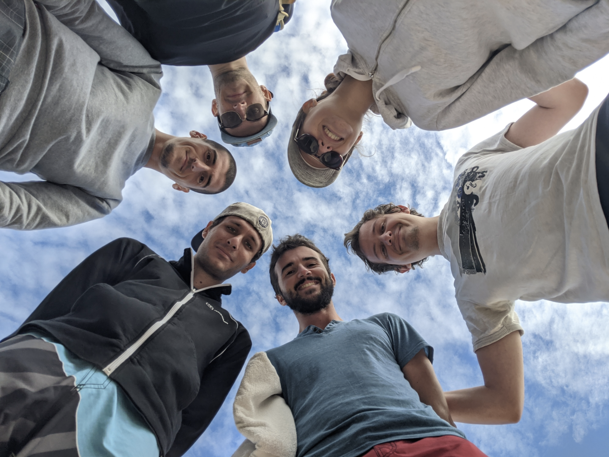

Still negative Covid test: I spent a few days in Amsterdam.

My second cat Speerou died, he was like my brother, 18 years old. It was very very very hard.

Family picture:
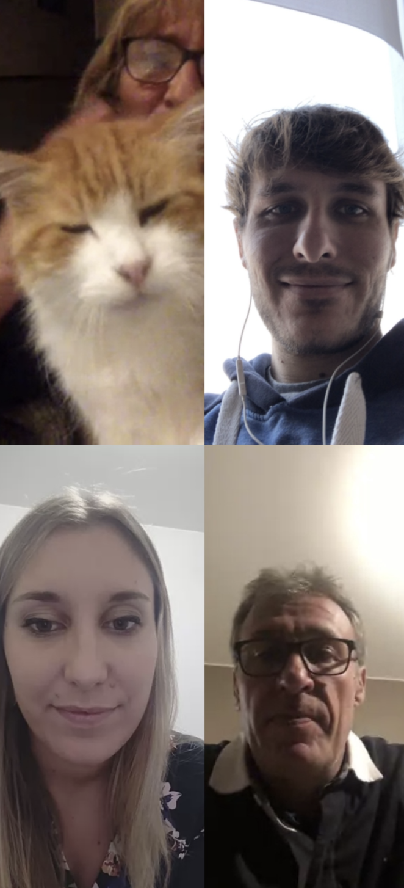

Me being sad every time I was leaving Bandol: (family town)

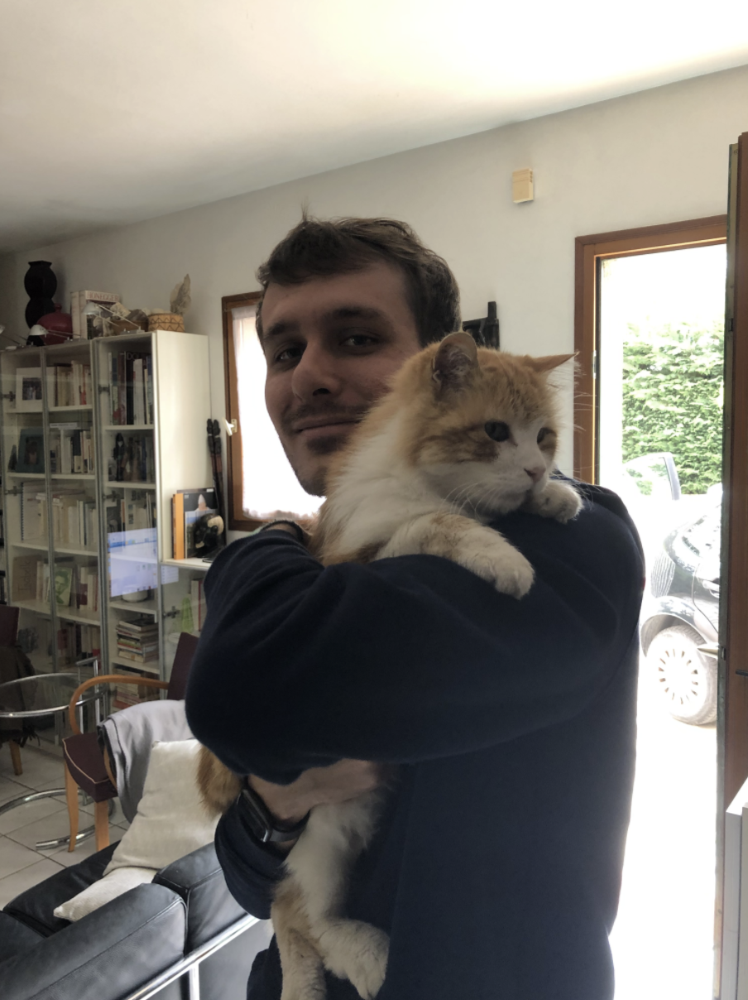

## October

I wanted to go back to the US, but there was a travel ban. So I needed to spend 14 days in Mexico because European couldn’t go directly to the US.

I first flew to Frankfurt, Germany, for a 20-hour layover.

Then flew to Cancun, Mexico.
I was in a nice hotel.

The issue was (1) always eating the same food for 14 days is not ideal.

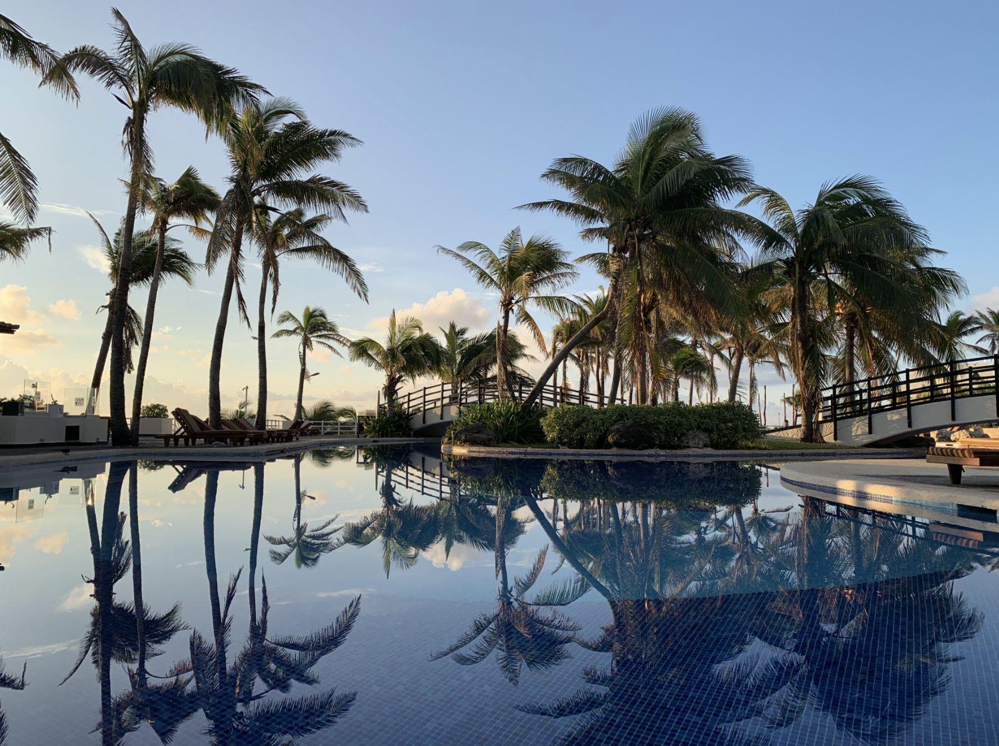

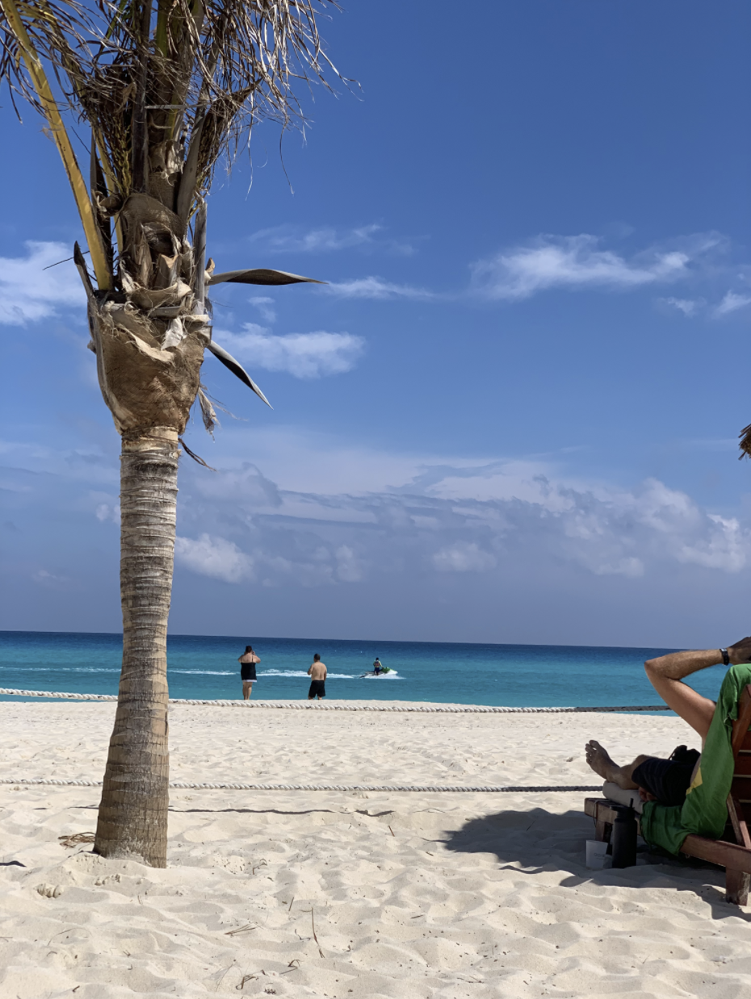

But more importantly (2) a hurricane, named Delta ([more info](https://eu.theadvertiser.com/picture-gallery/weather/hurricanes/2020/10/07/photos-hurricane-delta-damage-makes-landfall-cancun/5908225002/)), hit me and the hotel I was staying in.  
I was evacuated to a shelter for two days, it was not a nice experience.  
I was sleeping on the floor in a room full of people, it was looking like dead people.

My bed:

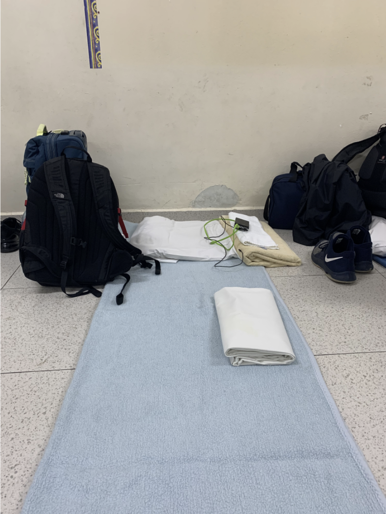

My room:

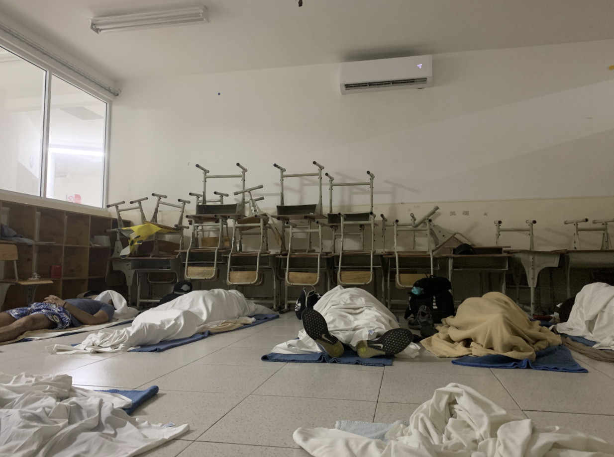

The morning after the hurricane:

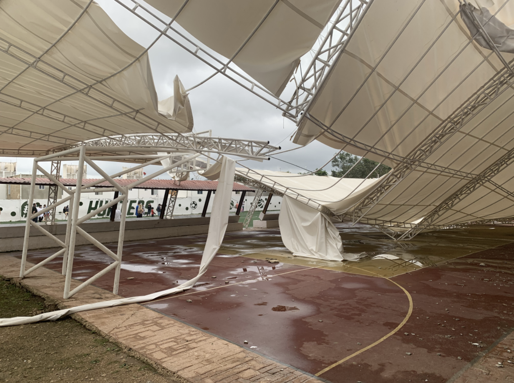

After a few more days spent in another place, I finally came back to the original hotel for a few days, then flew to San Francisco where I stayed for 3 weeks.

First dinner, best dinner, In-N-Out!

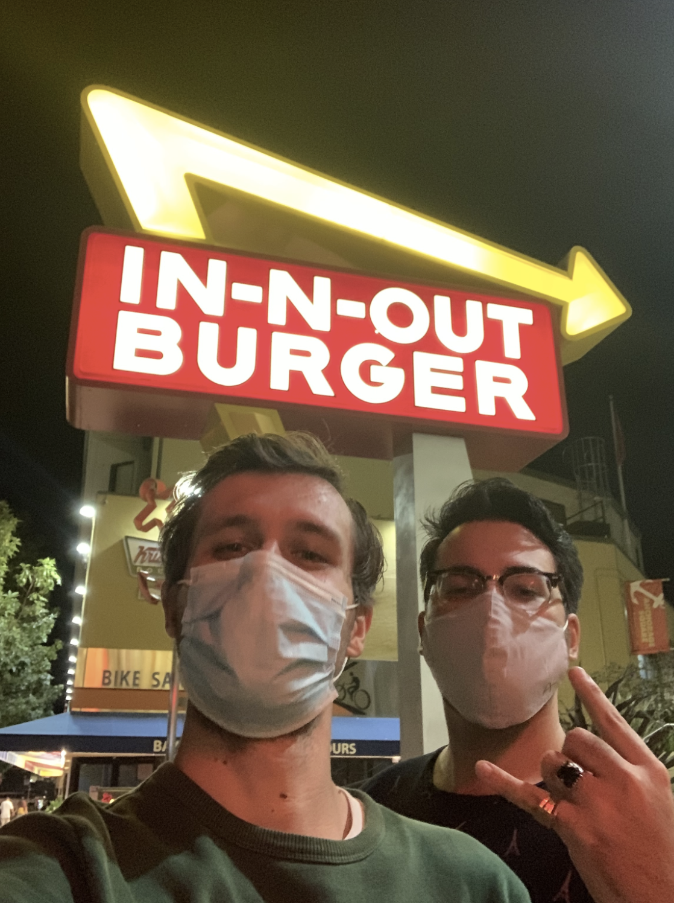

The plan was to go to LA, but then it changed to NYC, but it got canceled because of Covid so I ended up choosing Hawaii and went with my friend Zach.

## November

Hawaii was AMAZING. Highly recommend!  
I started surfing, almost everyday, best thing that happened in 2020 for sure!

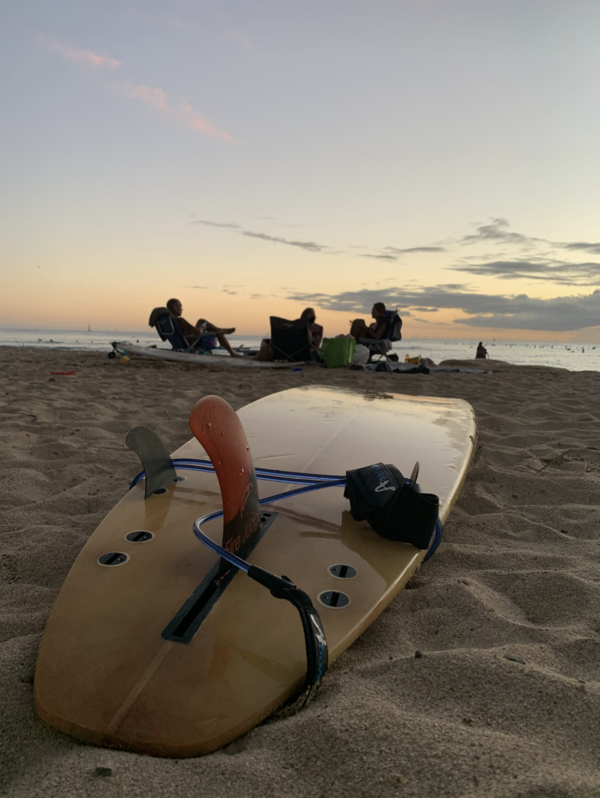

Almost everyday, I was going to the beach to watch the sunset.
My level of happiness around the beach and surfing was very high!!  
I hiked, rented a scooter, did my first skydiving jump: so beautiful! ([video](https://www.youtube.com/watch?v=YSLpYZO9cDU))

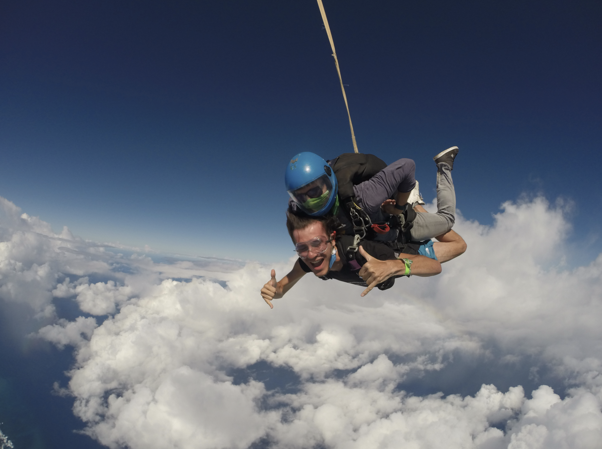

## December

After spending a full month in Hawaii, I came back to SF for a few days then flew to Amsterdam to see my friends.

I then took a train to Bandol, France.  
I surprised my mother by coming a few days earlier, then surprised my sister for her birthday!

I spent Christmas ([video](https://www.youtube.com/watch?v=TmcsTjK6f0g)) and NYE with the family.

During all this time traveling, from end of September to mid-December, I was staying in hotels.
Hotel life has some advantages, it’s clean, but food was an issue. (not being able to cook)  
I do love ordering from UberEats and eating burgers all the time, but twice a day, burger, pizza and burrito, it’s too much.

Finally, I met with a friend to do a song video summarizing our past 5 years. ([video](https://www.youtube.com/watch?v=JK3GOF3CS9Y))

My trading year went well (+71%) but I did lots of mistakes, I learned a lot and I’ll definitely learn more in 2021 and hopefully not do the same mistakes again.  
I will focus on risk management and I will cut losses earlier.

During all this time traveling, I was working remotely. It was not an issue. I am used to work late anyway so the time different was not an issue.

During 2020, I also did a few Tech projects, apps. That made me happy. (Pushups Master, Coucou, algo trading)

During 2020, Kathy (a colleague) and myself created the Uber Mentoring Program to help to bridge the gender gap in STEM by
creating opportunities for young women & non-binary individuals to explore their passions.  
Basically, it means that we match young women with Uber engineers for a few mentoring 1-1 sessions.

# Reflection

## How was it?

I will not talk about the impact of Covid on the world in this article because this is not the point.

The first half of 2020 sucked. Mainly because of my roommate situation.  
The second half sucked less, mainly because I saw more people, I did different things, visited different places.

The impact of Covid on my life was not terrible because I was lucky enough to be able to take advantage of the situation.  
Without Covid I wouldn't have been to Hawaii or Cancun.  
Because of Covid, meeting friends was hard and didn't happen often.  
Because of Covid, my VISAs got impacted, my greencard was delayed by a year and my H1B is still not processed because the embassies are closed.

## What makes me happy?

Not in order:

- coding, creating something useful
- marking tasks on a list as done ✅ (achievements)
- feeling part of a community
- surfing (anything related to water, but mainly surfing)
- writing articles
- teaching / mentoring
- learning
- good time with nice people
- time with pets, mainly cats
- close my rings ⌚️ (achievements)

## What do I want to focus on in 2021?

- learning, with a focus on trading
- focusing on my group of friends
- writing more articles
- continuing to create tech projects
- create more memories (eg YouTube videos)
- finding a way to teach Personal Finance to more people
- continuing to surf
- closing my rings ⌚️ (achievements)
- career: becoming Senior Software Engineer with Uber

I am guessing that I will write another article to set public goals for 2021.